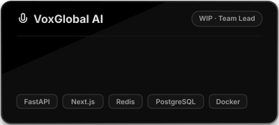
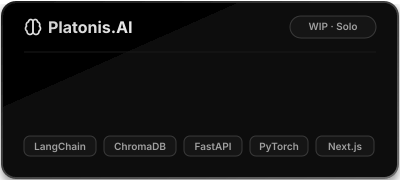
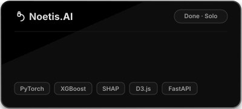
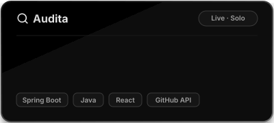

<div align="center">
  
</div>

<div align="center">

<pre align="center">
&gt; initializing Shreesha S Nekkar...
&gt; loading: Software engineer, AI-full-stack dev, chaos architect
&gt; status: ONLINE ⚪
</pre>

<a href="https://readme-typing-svg.demolab.com">
  
</a>

</div>

---

### `$ cat about.txt`

```text
name: Shreesha S Nekkar
handle: @shreeshasn
role: Software Engineer
base: Mysuru, Karnataka 🇮🇳

status: Building projects that doesn't break (most of the time)

current:
  VoxGlobal AI @ Artsy Technologies
  → event-driven dubbing platform
  → 3 microservices, 1 intern, 0 sleep

vibe: "GUI is just CLI with extra steps"

seeking:
  Interesting problems + good engineers
```

<br clear="right"/>

---

### `$ ls -la projects/ | grep featured`

<div align="center">
  <table border="0">
    <tr>
      <td align="center">
        <a href="https://github.com/shreeshasn/VoxGlobal_AI">
          <picture>
            <source media="(prefers-color-scheme: dark)" srcset="./assets/voxglobal-dark.svg"/>
            <source media="(prefers-color-scheme: light)" srcset="./assets/voxglobal.svg"/>
            
          </picture>
        </a>
      </td>
      <td align="center">
        <a href="https://github.com/shreeshasn/Platonis.AI">
          <picture>
            <source media="(prefers-color-scheme: dark)" srcset="./assets/platonis-dark.svg"/>
            <source media="(prefers-color-scheme: light)" srcset="./assets/platonis.svg"/>
            
          </picture>
        </a>
      </td>
    </tr>
    <tr>
      <td align="center">
        <a href="https://github.com/shreeshasn/Noetis.AI">
          <picture>
            <source media="(prefers-color-scheme: dark)" srcset="./assets/noetis-dark.svg"/>
            <source media="(prefers-color-scheme: light)" srcset="./assets/noetis.svg"/>
            
          </picture>
        </a>
      </td>
      <td align="center">
        <a href="https://audita.onrender.com">
          <picture>
            <source media="(prefers-color-scheme: dark)" srcset="./assets/audita-dark.svg"/>
            <source media="(prefers-color-scheme: light)" srcset="./assets/audita.svg"/>
            
          </picture>
        </a>
      </td>
    </tr>
  </table>
</div>

---

### `$ ./stack.sh --show-all`

<div align="center">


</div>

---

<!--
### `$ git shortlog --contributions`

<div align="center">

[](https://github.com/shreeshasn)

<br>

</div>
-->
### `$ git shortlog --contributions`
<div align="center">
  <!--
  Old Dynamic Vercel/Heroku Stats URLs (Inactive):
  <table border="0" cellspacing="0" cellpadding="0">
    <tr>
      <td align="center" valign="top">
        <a href="https://github.com/shreeshasn">
          
        </a>
      </td>
      <td align="center" valign="top" rowspan="2" style="padding-left: 10px;">
        <a href="https://github.com/shreeshasn">
          
        </a>
      </td>
    </tr>
    <tr>
      <td align="center" valign="top" style="padding-top: 10px;">
        <a href="https://github.com/shreeshasn">
          
        </a>
      </td>
    </tr>
  </table>
  -->
  <!-- Active Symmetrical Stats (Generated by GitHub Actions using PAT on output branch) -->
  <table border="0" cellspacing="0" cellpadding="0">
    <tr>
      <td align="center" valign="top">
        <a href="https://github.com/shreeshasn">
          <picture>
            <source media="(prefers-color-scheme: dark)" srcset="https://raw.githubusercontent.com/shreeshasn/shreeshasn/output/assets/github-readme-stats-dark.svg"/>
            <source media="(prefers-color-scheme: light)" srcset="https://raw.githubusercontent.com/shreeshasn/shreeshasn/output/assets/github-readme-stats.svg"/>
            
          </picture>
        </a>
      </td>
      <td align="center" valign="top" rowspan="2" style="padding-left: 10px;">
        <a href="https://github.com/shreeshasn">
          <picture>
            <source media="(prefers-color-scheme: dark)" srcset="https://raw.githubusercontent.com/shreeshasn/shreeshasn/output/assets/github-top-langs-dark.svg"/>
            <source media="(prefers-color-scheme: light)" srcset="https://raw.githubusercontent.com/shreeshasn/shreeshasn/output/assets/github-top-langs.svg"/>
            
          </picture>
        </a>
      </td>
    </tr>
    <tr>
      <td align="center" valign="top" style="padding-top: 10px;">
        <a href="https://github.com/shreeshasn">
          <picture>
            <source media="(prefers-color-scheme: dark)" srcset="https://raw.githubusercontent.com/shreeshasn/shreeshasn/output/assets/github-streak-stats-dark.svg"/>
            <source media="(prefers-color-scheme: light)" srcset="https://raw.githubusercontent.com/shreeshasn/shreeshasn/output/assets/github-streak-stats.svg"/>
            
          </picture>
        </a>
      </td>
    </tr>
  </table>
</div>

---

### `$ python3 -c "import me; me.snake()"`

<div align="center">

<picture>
  <source media="(prefers-color-scheme: dark)" srcset="https://raw.githubusercontent.com/shreeshasn/shreeshasn/output/github-contribution-grid-snake-dark.svg"/>
  <source media="(prefers-color-scheme: light)" srcset="https://raw.githubusercontent.com/shreeshasn/shreeshasn/output/github-contribution-grid-snake.svg"/>
  
</picture>

</div>

### `$ achievements --list`

<div align="center">
  <a href="https://github.com/shreeshasn?tab=achievements"></a>
  <a href="https://github.com/shreeshasn?tab=achievements"></a>
  <a href="https://github.com/shreeshasn?tab=achievements"></a>
  <a href="https://github.com/shreeshasn?tab=achievements"></a>
  <a href="https://github.com/shreeshasn?tab=achievements"></a>
</div>

---  

### `$ ping me --connect`

<div align="center">

[](https://linkedin.com/in/shreesha-s-nekkar)
[](https://shreeshasn.github.io)
[](mailto:shreeshasnekkar81@gmail.com)
[](https://leetcode.com/u/Shreesha81/)
[](https://x.com/shreeshasn)
[](https://medium.com/@shreeshasnekkar81)

<br/>


<br/>

<pre align="center">
/* TODO: write a funnier quote */

cat /dev/brutalist-portfolio | grep awesome

Real developers don't need buttons.
— SSN, probably
</pre>


</div>
